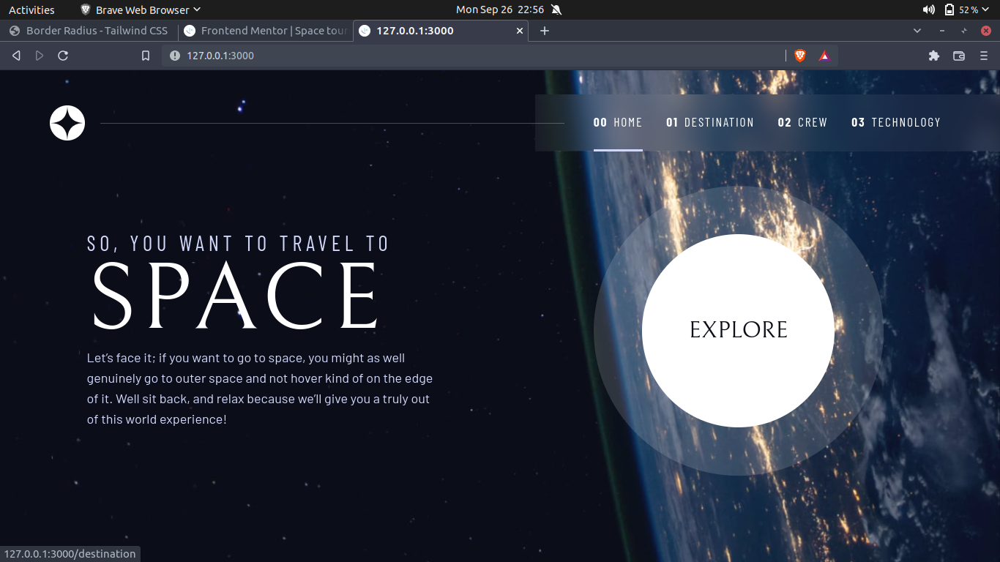
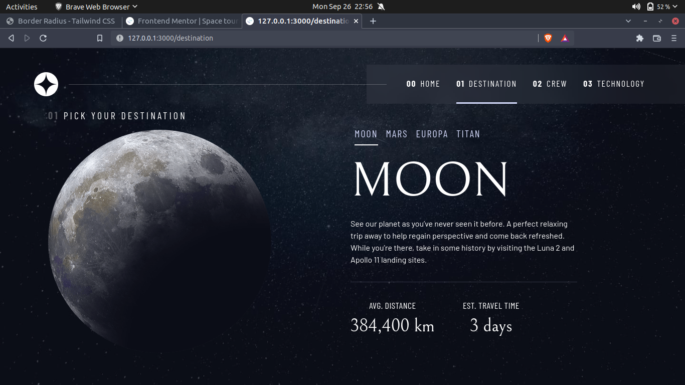
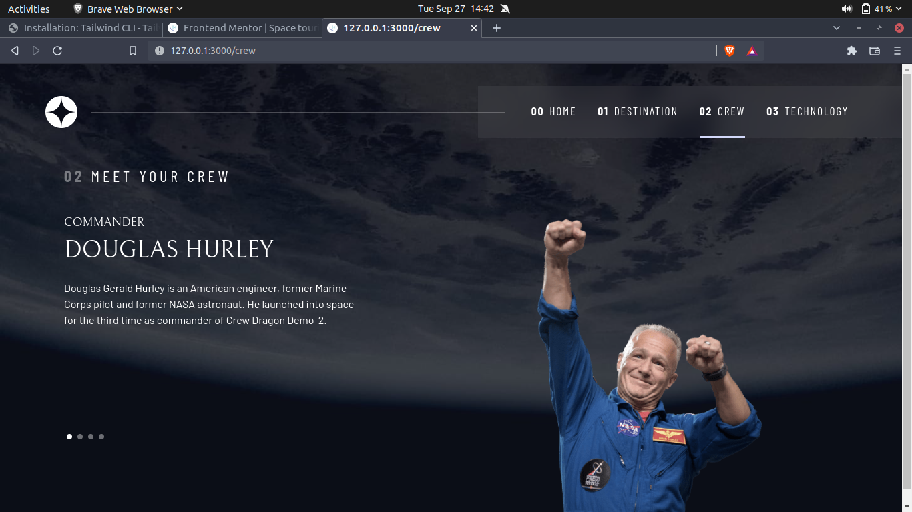
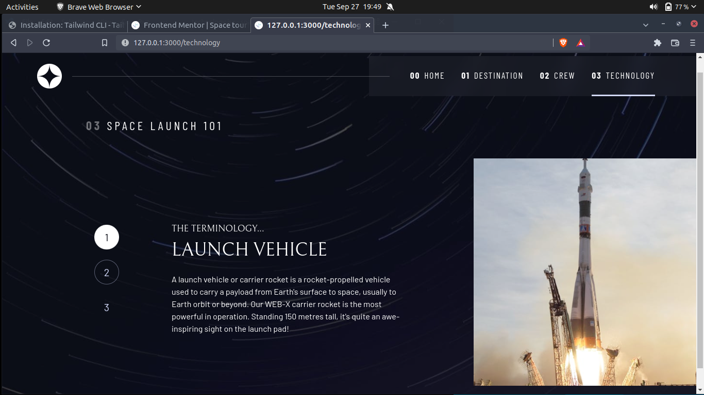

# Frontend Mentor - Space tourism website solution(React and tailwind)

This is a solution to the [Space tourism website challenge on Frontend Mentor](https://www.frontendmentor.io/challenges/space-tourism-multipage-website-gRWj1URZ3). Frontend Mentor challenges help you improve your coding skills by building realistic projects.

## Table of contents

- [Overview](#overview)
  - [The challenge](#the-challenge)
  - [Screenshot](#screenshot)
  - [Links](#links)
- [My process](#my-process)
  - [Built with](#built-with)
  - [What I learned](#what-i-learned)
  - [Continued development](#continued-development)
  - [Useful resources](#useful-resources)
- [Author](#author)
- [Acknowledgments](#acknowledgments)

## Overview

### The challenge

Users should be able to:

- View the optimal layout for each of the website's pages depending on their device's screen size
- See hover states for all interactive elements on the page
- View each page and be able to toggle between the tabs to see new information

### Screenshots






### Links

- Solution URL: [https://github.com/kole332/space-tourism-react](https://github.com/kole332/space-tourism-react)
- Live Site URL: [https://space-tourism-react-flax.vercel.app](https://space-tourism-react-flax.vercel.app)

## My process

### Built with

- Semantic HTML5 markup
- CSS custom properties
- Flexbox
- CSS Grid
- Jsx
- Mobile-first workflow
- [React](https://reactjs.org/) - JS library
- [Next.js](https://nextjs.org/) - React framework
- [tailwindcss](https://tailwindcss.com/) - For styles

### What I learned

- Normal dom manipulations can be performed within `useEffect` hook.

```js
React.useEffect(() => {
  document.querySelector("body").classList.value = "home";
  const active = document.querySelector('[aria-selected="home"]');
  if (active) {
    active.setAttribute("aria-selected", true);
  }
}, []);
```

- Extending and Adding tailwindcss properties, functions, plugins, etc.

```js
module.exports: {
  // extending properties
  extend: {
    fontFamily: {
      sans: ["Barlow", ...defaultTheme.fontFamily.sans],
      serif: ["Bellefair", ...defaultTheme.fontFamily.serif],
      "sans-cond": ["Barlow Condensed", ...defaultTheme.fontFamily.sans],
    },
  }

  plugins: [
    plugin(function ({ addVariant, addUtilities, matchUtilities, theme }) {
      addVariant("optional", "&:optional");

      // static properties
      addUtilities({
        ".content-empty": {
          content: "''",
        },
      });

      // dynamic properties
      matchUtilities(
        {
          "margin-block": (value) => ({
            marginBlock: value,
          }),
        },
        { values: theme("marginBlock") }
      );
    }),
  ]
}

```

### Continued development

Despite being written with poor code, I've completed index and destination pages and hoping to complete other pages ASAP.

### Useful resources

- [Reactjs docs](https://reactjs.org/) - Provides extensive documentation on Reactjs library.
- [Tailwindcss docs](https://tailwindcss.com) - For everything related to tailwindcss.
- [Nextjs docs](https://nextjs.org/) - This is what you need for nextjs.
- [React for Beginners](https://www.youtube.com/watch?v=bMknfKXIFA8) - Thank you Bob Ziroll, Scrimba and Freecodecamp for this react lesson

## Author

- Dayal Moirangthem

## Acknowledgments

I came across this project on freecodecamp's video lesson [Create a Design System with CSS](https://youtu.be/lRaL-8qZ0mM) by Kevin Powell. After completing the project in html, css and js, I'm rebuilding it using Reactjs, Nextjs and Tailwindcss.
